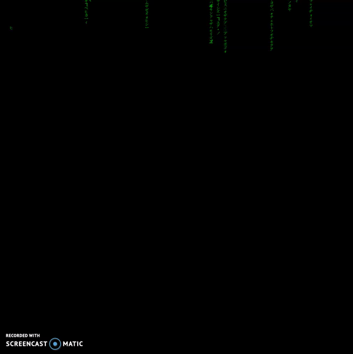

# **Matrix Rain in Processing (Java)**
## Red or Blue pill?

Well, no need to ask since you are here to see how deep the rabbit hole goes .... so you pretty much answered your own question. ;)  

This is a Matrix rain text from the movie *(you guessed it)* Matrix which (I think)
has never been done in Java before!!!  

## Do you want to get it?

Great, you can download it [HERE](https://1drv.ms/f/s!AnEExJKHUjgQgZ5o0-Sd77f36HeYlg). Pick one based on your operating system and download that folder!

## Want to contribute/found a bug?
Write an email to me: *krysbaran@gmail.com*

### Sources and inspiration
- [**CodePen**](https://codepen.io/yaclive/pen/EayLYO) by Clive Cooper
- [**Freecodecamp**](https://www.freecodecamp.org/news/canmaking-it-rain-code-matrix-style-ec6e1386084e/)
- [**Guest Tutorial #4: Matrix Digital Rain in p5.js with Emily Xie**](https://www.youtube.com/watch?v=S1TQCi9axzg&t=2052s) by [The Coding Train](https://www.youtube.com/channel/UCvjgXvBlbQiydffZU7m1_aw)
